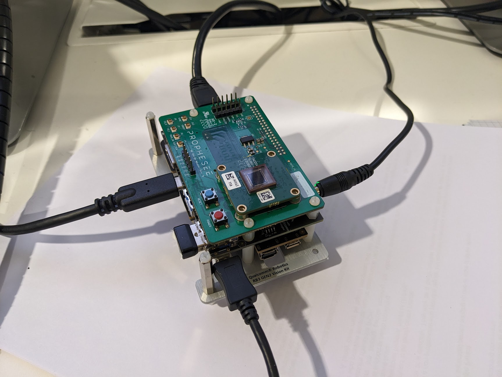

# Prophesee Metavision on Qualcomm RB3 Gen2 kit

This repository hosts a layer for the OpenEmbedded Build system, as used in the Yocto Project, customizing the behavior the `qcom-wayland` distro to interface an Event-Based Sensor on a Qualcomm RB3 Gen2 kit.

It is written as minimum modifications to reach this goal, and does not aim at being reusable in other projects.

## Hardware setup

This layer was writen to be used on top of the Core Kit of the Qualcomm RB3 Gen 2 Development Kit. The Vision Mezzanine is replaced with a Prophesee `96 Boards Adapter Rev. B`, interfacing a Prophesee `CCAM5 IMX636`.

The `CCAM5 IMX636` is a camera module with a Sony IMX636 sensor, power regulators, a clock generator, and hardware power-supply sequencers (also used in Metavision EVK3 and Embedded Starter Kits).

The `96 Boards Adapter Rev. B` is an adapter board between boards with `96Boards CE`-compliant extension connectors and Prophesse CCAM5 connectors (not available for retail).



## Prerequisite

This layer has been built against Qualcomm release `qcom-6.6.38-QLI.1.2-Ver.1.1_qim-product-sdk-1.1.2.xml`.

It is assumed that, before using this layer, you are able to build, flash and run `qcom-multimedia-image`.

Refer to [Qualcomm Documentation](https://docs.qualcomm.com/bundle/publicresource/topics/80-70015-254/introduction.html) to build images for the RB3 Gen2 kit.

## Build the image

Starting from the workspace used to build `qcom-multimedia-image`, clone this repository in the `layers` folder:

```
cd <workspace_path>/layers/
git clone https://github.com/prophesee-ai/meta-prophesee-rb3gen2.git -b QLI.1.2-branch
```

Setup the environment, including this new layer, and build the image including V4L2 tools and Prophesee software

```
cd <workspace_path>/
MACHINE=qcs6490-rb3gen2-vision-kit DISTRO=qcom-wayland QCOM_SELECTED_BSP=custom EXTRALAYERS=meta-prophesee-rb3gen2 source setup-environment
# Sourcing setup-environment moves to <workspace_path>/build-qcom-wayland/
bitbake prophesee-image
```

## Use the image

This image is based on a copy of `qcom-multimedia-image` (public version), it uses the same `root`/`oelinux123` login/password.

### After flashing, switch to CamSS

Prophesee software and drivers use standard V4L2/media-ctl interfaces, while Qualcomm uses its own camera stack by default. However, Qualcomm provides a standard V4L2 implementation, named CamSS (for camera subsystem).
More information on this topic is available [here](https://docs.qualcomm.com/bundle/publicresource/topics/80-70015-17/v4l2_interface.html).

The first step after flashing the image is to remove the camera.ko module from the kernel module path, so that CamSS is used instead. Run the following commands on the kit:

```
mount -o rw,remount /
mv /lib/modules/*/updates/camera.ko /
reboot
```

Those commands include a reboot, and need only to be run once after the board has been re-flashed with the image.

### After booting, configure the Video pipeline

Then to use the sensor, you need to configure the video pipeline. This configuration is not implemented in a pipeline handling library yet (such as [libcamera](https://libcamera.org/)), but it can be done from command line with the following script:

```
# Set the sensor to output Prophesee Evt2.1 (legacy, middle-endian) format
media-ctl -d /dev/media1 -V "'imx636 16-003c':0[fmt:PSEE_EVT21ME/4096x391]"
# Enable End-Of-Frame marker
v4l2-ctl -d /dev/v4l-subdev27 -c enable_end_of_frame_marker=3
# Set the whole path with the same format
media-ctl -d /dev/media1 -V '"msm_csiphy0":0[fmt:PSEE_EVT21ME/4096x391]'
media-ctl -d /dev/media1 -V '"msm_csiphy0":1[fmt:PSEE_EVT21ME/4096x391]'
media-ctl -d /dev/media1 -V '"msm_csid0":0[fmt:PSEE_EVT21ME/4096x391]'
media-ctl -d /dev/media1 -V '"msm_csid0":1[fmt:PSEE_EVT21ME/4096x391]'
media-ctl -d /dev/media1 -V '"msm_vfe0_rdi0":0[fmt:PSEE_EVT21ME/4096x391]'
media-ctl -d /dev/media1 -V '"msm_vfe0_rdi0":1[fmt:PSEE_EVT21ME/4096x391]'
# Link the blocks
media-ctl -d /dev/media1 -l '"msm_csiphy0":1->"msm_csid0":0[1]'
media-ctl -d /dev/media1 -l '"msm_csid0":1->"msm_vfe0_rdi0":0[1]'
# Set the output for Evt2.1
v4l2-ctl -v width=4096,height=391,pixelformat=PSE1
```

Note: this assumes that CamSS driver spawned as `media1`, and that CCI-0 is bus 16. This may be checked with the following commands:

```
# media-ctl -p -d /dev/media1 | grep camss
driver          qcom-camss
bus info        platform:acaf000.camss
# cat /sys/dev/char/81\:*/name | grep imx
imx636 16-003c
```

### Capture video

The [Yavta test application](https://git.ideasonboard.org/yavta.git) validates the camera using the V4L2 interface.

Run Yavta to capture event stream:

```
# yavta -c4 -F /dev/video0
Device /dev/video0 opened.
Device `Qualcomm Camera Subsystem' on `platform:acaf000.camss' (driver 'qcom-camss') supports video, capture, with mplanes.
Video format: PSE1 (31455350) 4096x391 field none, 1 planes: 
 * Stride 4096, buffer size 1601536
8 buffers requested.
length: 1 offset: 3266213480 timestamp type/source: mono/EoF
Buffer 0/0 mapped at address 0x7fab9b9000.
length: 1 offset: 3266213480 timestamp type/source: mono/EoF
Buffer 1/0 mapped at address 0x7fab832000.
length: 1 offset: 3266213480 timestamp type/source: mono/EoF
Buffer 2/0 mapped at address 0x7fab6ab000.
length: 1 offset: 3266213480 timestamp type/source: mono/EoF
Buffer 3/0 mapped at address 0x7fab524000.
length: 1 offset: 3266213480 timestamp type/source: mono/EoF
Buffer 4/0 mapped at address 0x7fab39d000.
length: 1 offset: 3266213480 timestamp type/source: mono/EoF
Buffer 5/0 mapped at address 0x7fab216000.
length: 1 offset: 3266213480 timestamp type/source: mono/EoF
Buffer 6/0 mapped at address 0x7fab08f000.
length: 1 offset: 3266213480 timestamp type/source: mono/EoF
Buffer 7/0 mapped at address 0x7faaf08000.
0 (0) [-] none 0 1601536 B 1025.420679 1025.421099 521.921 fps ts mono/EoF
1 (1) [-] none 1 1601536 B 1025.422672 1025.423014 501.756 fps ts mono/EoF
2 (2) [-] none 2 1601536 B 1025.424675 1025.425015 499.251 fps ts mono/EoF
3 (3) [-] none 3 1601536 B 1025.426684 1025.427033 497.760 fps ts mono/EoF
Captured 4 frames in 0.008269 seconds (483.698046 fps, 0.000000 B/s).
8 buffers released.
```

### Display video

To get a display of the event stream, Metavision SDK provides `metavision_viewer`, an application generating frames displaying the pixel events that occured recently.

Unless requested otherwise, this application open the first available camera. Once the pipeline is set, you can simply run
```
metavision_viewer
```

However, this uses the default allocatior from the driver for the video buffer memory. On other platforms, accessing those buffers from CPU has a huge performance hit (this was not checked on RB3 Gen2), it is possible to allocate memory from a DMA buffer heap (in `/dev/dma_heap/`) by setting a environment variable.

```
export V4L2_HEAP=reserved
metavision_viewer
```

The above commands will make Metavision SDK allocate memory from `/dev/dma_heap/reserved`, which gives access to the memory reserved for the continuous memory allocator (CMA). The number of buffers allocated by Metavision SDK was patched to fit in it, but this leaves little memory for an other user of the CMA. A more comprehensive solution would be to add a dedicated heap in the platform.


## Current limitations

### Data recording and replay

Metavision records raw data by copying the input buffer in the destination file. On RB3 Gen2, the V4L2 interface does not report the actual transfered size (it is unknown if the DMA provides this information, since it was designed for frames of known size). The whole allocated memory gets written in the file, but for low-activity scenes, 99% of the allocated memory may be unused. Always saving the whole buffer requires a huge bandwidth on the storage device, and wastes a lot of space.

Moreover, replaying the file, the read size on files is not the same as the buffers on the V4L2 interface, thus the mechanism skipping the unwritten part of buffers gets broken. This could be avoided by saving the buffer size in the raw, but this was not implemented since the recording itself should be reworked.

However, recordings done on other platforms, such as public datasets from Prophesee, or recordings from EVKs, do not include EOF-markers, and can be replayed on RB3 Gen2 (for instance to evaluate the portage of processing algorithms on this platform, using known data).

### OpenGL support broken in Metavision SDK

While `metavision_viewer` uses CPU rendering, many code samples from Metavision use OpenGL(ES) for rendering. Those are not functional, a rendering thread stops early in the program execution, the reason is yet to be investigated

### Sometimes, Metavision SDK streaming does not start

Sometimes, streaming stops as soon as it starts. More specifically (this may be seen by exporting `MV_LOG_LEVEL=TRACE`), the `poll` on the V4L2 device reports an error. Until now, this was only observed when stopping the streaming, and makes the streaming thread end. Re-starting the application does not reproduce the issue (meaning that the application runs as expected on the second run). Since no such issue was seen with `yavta`, the V4L2 plugin for Metavision SDK is probably to be fixed.
